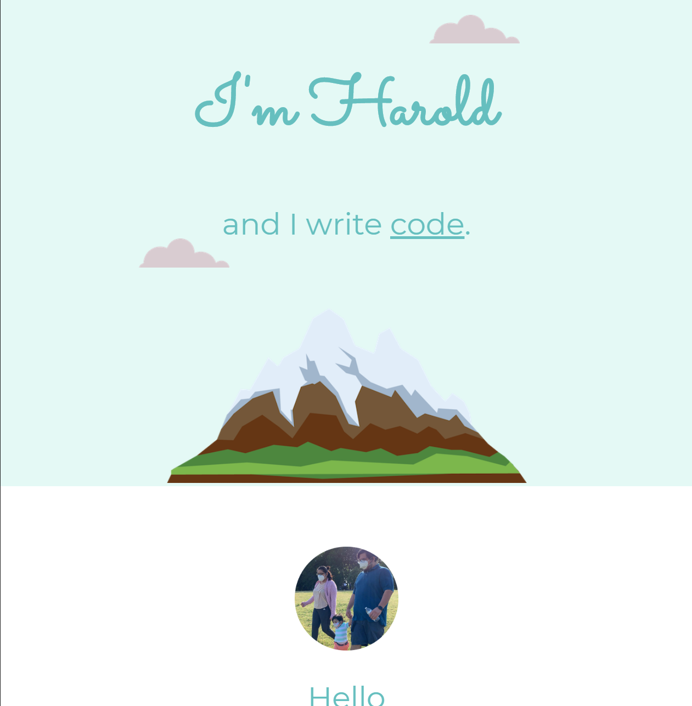
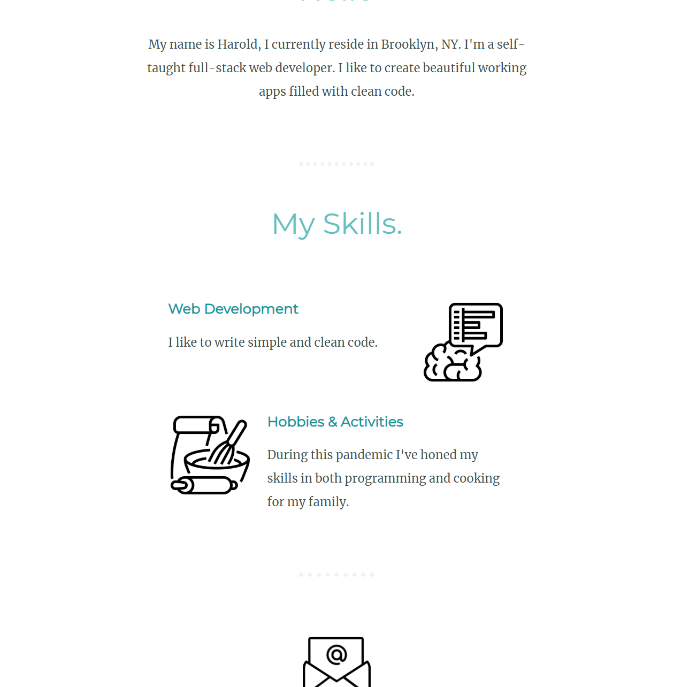
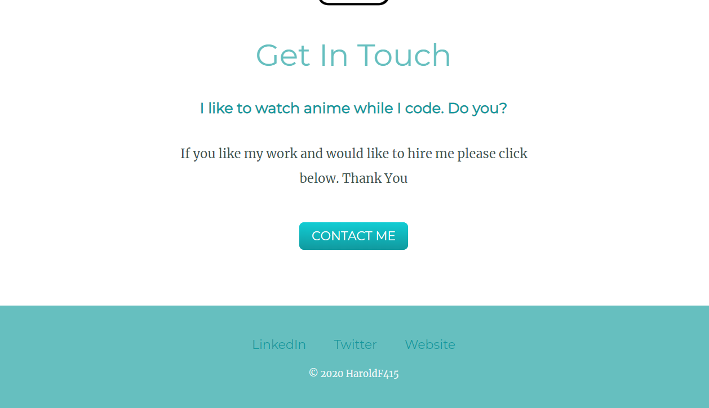

# my-site

> Assignment #2 in Full-Stack Web Development Bootcamp 2020 by Dr. Angela Yu
___
### Table of Contents

- [Description](#description)
- [Usage](#usage)
- [Credits](#credits)
___
## Description
The second assignment in this course presented us with a more extensive look at styling our website with CSS. We moved beyond from only using HTML. We made use of images to create our 'landing page', using <a href="https://colorhunt.com">colorhunt</a> to look through color palettes to further style our website. We cropped out the main image with the help of <a href="https://crop-circle.imageonline.com">crop-circle</a>, custom images were added to our page by searching through <a href="https://Flaticon.com">flaticon</a> images. <a href="https://fonts.google.com/">Google Fonts</a> was used to provide a new way to render our fonts. Finally we made use of <a href="https://css3buttongenerator.com">CSS3ButtonGenerator</a> to create our button for our contact me link.

#### Technologies Used:
- HTML
- CSS
- <a href="https://atom.io/">Atom</a>
- <a href="https://colorhunt.com">colorhunt</a>
- <a href="https://crop-circle.imageonline.com">crop-circle</a>
- <a href="https://Flaticon.com">flaticon</a>
- <a href="https://fonts.google.com/">google fonts</a>
- <a href="https://css3buttongenerator.com">CSS3ButtonGenerator</a>

___

## Usage
This project has no usage other than to present future employers of my progress as a Fullstack Web Developer.
___

## Credits
- Dr. Angela Yu
- Udemy
